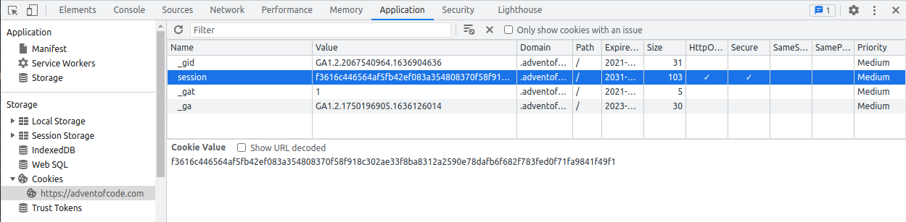

# Advent of Code Downloader

Simple PHP-based utility to download all [Advent of Code](https://adventofcode.com/) puzzles and inputs locally.

## Requirements

This project requires PHP 7.4 or higher.

## Installation

```bash
git clone https://github.com/colinodell/aoc-downloader.git
cd aoc-downloader
composer update -o --no-dev
```

## Usage

You'll need to log into <adventofcode.com> and grab your `session` cookie using your browser's dev tools:



You can then pass that as an argument to this utility:

```
Usage:
  ./bin/aoc-downloader [options] [--] <session_id>

Arguments:
  session_id            Session ID (from the adventofcode.com `session` cookie

Options:
  -o, --output=OUTPUT   The directory to save the downloaded files [default: "./output"]
  -y, --year=YEAR       The year to download puzzles for (default is all years)
  -h, --help            Display help for the given command. When no command is given display help for the ./bin/download.php command
  -q, --quiet           Do not output any message
  -V, --version         Display this application version
      --ansi|--no-ansi  Force (or disable --no-ansi) ANSI output
  -n, --no-interaction  Do not ask any interactive question
  -v|vv|vvv, --verbose  Increase the verbosity of messages: 1 for normal output, 2 for more verbose output and 3 for debug
```
